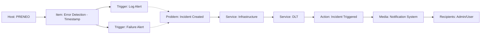

```mermaid
flowchart LR
    A[Host: PRENEO]
    B[Item: Error Detection - Timestamp]
    C[Trigger: Log Alert]
    D[Trigger: Failure Alert]  
    E[Problem: Incident Created]
    F[Service: Infrastructure]  
    G[Service: DLT]
    H[Action: Incident Triggered]
    I[Media: Notification System]
    J[Recipients: Admin/User] 

    A --> B 
    B --> C
    B --> D
    C -.-> E
    D -.-> E
    E --> F
    F --> G
    G --> H
    H --> I
    I --> J
```
